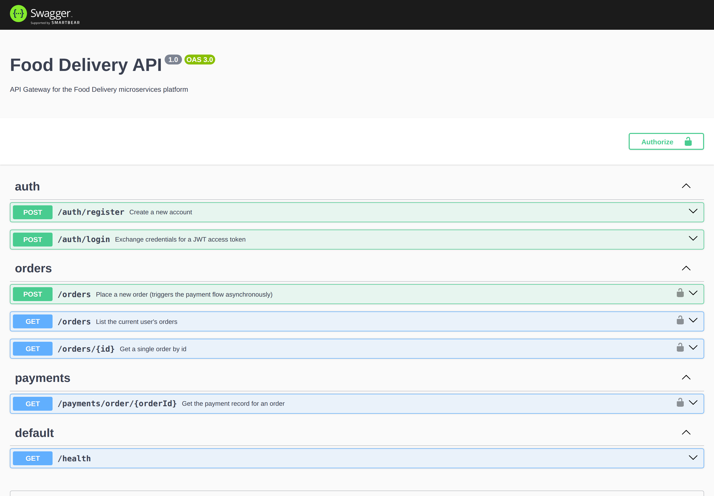
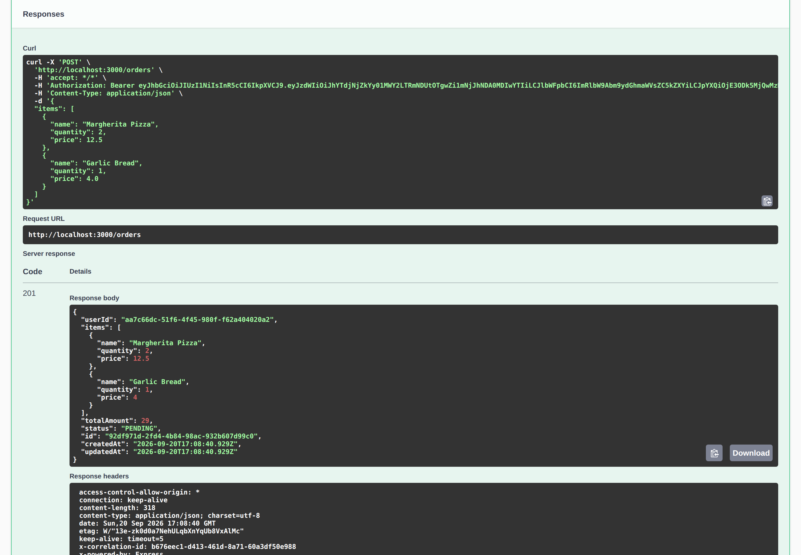
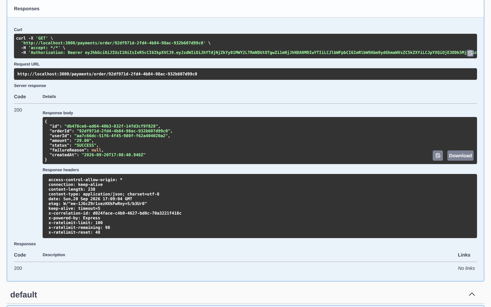

# Food Delivery Backend

[](https://github.com/MajidLabs/food-delivery-backend/actions/workflows/ci.yml)


## Screenshots

Interactive API docs (Swagger), and a real request flow: placing an order
through the Gateway triggers the Payment Service asynchronously over
RabbitMQ — no direct call between them.

<table>
<tr>
<td></td>
<td></td>
</tr>
<tr>
<td align="center">Interactive API docs</td>
<td align="center">POST /orders — 201 Created</td>
</tr>
</table>


<p align="center"><em>Payment status flips to SUCCESS moments later — set by the Payment Service reacting to a RabbitMQ event, not a direct call from the order request.</em></p>

A production-style microservices backend for a food-delivery platform.

It consists of an API Gateway in front of independent **User**, **Order**,
and **Payment** NestJS services, communicating over RabbitMQ (both
request/response RPC and event-driven messaging), with PostgreSQL storage,
Redis caching, JWT auth, structured logging, health checks, two layers of
retry, 24 automated tests (22 unit + 2 end-to-end - see [Tests](#tests)),
and a GitHub Actions pipeline that builds and publishes Docker images.

Full write-up of *why* it's built this way - including a real integration
bug this project's own testing caught and fixed - is in
[ARCHITECTURE.md](./ARCHITECTURE.md). A step-by-step way to verify all of
this yourself is in [CHECKLIST.md](./CHECKLIST.md).

## Contents

- [Why this project](#why-this-project)
- [What this demonstrates](#what-this-demonstrates)
- [Architecture](#architecture)
- [Stack](#stack)
- [Quick start (Docker)](#quick-start-docker)
- [Try it](#try-it)
- [Verify it works](#verify-it-works)
- [Local development (without Docker)](#local-development-without-docker)
- [Tests](#tests)
- [CI/CD](#cicd)
- [Project structure](#project-structure)
- [Environment variables](#environment-variables)
- [Known limitations](#known-limitations)
- [License](#license)

## Why this project

This project demonstrates how a small food-delivery backend can be designed
as independently deployable services while still handling authentication,
messaging, retries, caching, failures, and asynchronous payment processing.

The focus is on architecture and reliability rather than building a full
consumer-facing food-delivery product.

## What this demonstrates

- **Microservices architecture** - an API Gateway plus three independently
  built, tested, and deployable NestJS services, each with its own
  database, Dockerfile, and CI job.
- **Both messaging patterns over one broker** - synchronous request/response
  RPC (Gateway -> service) *and* asynchronous event-driven pub/sub
  (Order ⇄ Payment), on deliberately separate RabbitMQ queues so a slow
  event consumer can never block a fast RPC call.
- **Two layers of retry, for two different failure modes** - in-process
  exponential backoff for "this call might just need a moment," and
  message-level redelivery with a dead-letter queue for "this needs to
  survive a process restart."
- **Auth done the boring, correct way** - bcrypt(-compatible) password
  hashing, JWTs verified locally at the Gateway (no chatty round-trip to
  User Service per request), per-resource ownership checks, input
  validation, rate limiting.
- **Caching with real invalidation** - Redis read-through cache on order
  lookups, explicitly busted the moment an order's status changes, not just
  left to expire.
- **Observability basics** - structured JSON logs, correlation IDs,
  per-service health checks tailored to what each service actually depends
  on (no service reports itself unhealthy because of a dependency it
  doesn't use).
- **A real CI/CD pipeline** - lint -> unit test -> build -> Docker build ->
  publish to GHCR, matrixed across all four services, using nothing but the
  automatic `GITHUB_TOKEN`.
- **Tested against real infrastructure, not just mocks** - unit tests mock
  their boundaries (fast, deterministic); separately, a one-time **manual**
  pass ran the whole stack end-to-end against real PostgreSQL/Redis/
  RabbitMQ and caught two real bugs no unit test would have: a RabbitMQ
  queue-declaration mismatch that crashed a service on boot (see
  [ARCHITECTURE.md](./ARCHITECTURE.md#messaging-two-queues-per-service-on-purpose)),
  and messages published as non-persistent despite "durable" queues, found
  by reading the transport library's source and confirmed on the wire with
  a RabbitMQ packet trace (see
  [ARCHITECTURE.md](./ARCHITECTURE.md#two-layers-of-retry)).
  [`scripts/health-check.sh`](./scripts/health-check.sh) is a **separate,
  automated** 20-assertion script that reproduces the same kind of
  end-to-end check going forward - it didn't find either bug itself, it
  exists so the next regression doesn't need a manual pass to catch.

## Architecture

```
Client -> API Gateway (:3000) ─RPC/RabbitMQ─┬-> User Service (:3001) -> PostgreSQL
                                            ├-> Order Service (:3002) -> PostgreSQL, Redis
                                            └-> Payment Service (:3003) -> PostgreSQL
                        Order Service ⇄ Payment Service via RabbitMQ events
```

See [ARCHITECTURE.md](./ARCHITECTURE.md) for the full diagram, the
messaging contract (which queue carries which message, and why there are
two per service), the order/payment sequence, and the reasoning behind
every other decision.

## Stack

Docker & Docker Compose · RabbitMQ · Redis · PostgreSQL · NestJS (×4) ·
TypeORM · JWT auth (Passport) · `@nestjs/terminus` health checks ·
`@nestjs/swagger` · Jest · GitHub Actions

## Quick start (Docker)

Requires Docker and Docker Compose.

```bash
git clone <this-repo>
cd food-delivery-backend
docker compose up --build
```

That builds and starts all seven containers (Postgres, Redis, RabbitMQ, and
the four NestJS services) wired together, with healthchecks gating startup
order.

| Service              | URL                              |
|-----------------------|-----------------------------------|
| API Gateway            | http://localhost:3000              |
| Swagger docs            | http://localhost:3000/api/docs     |
| RabbitMQ management UI  | http://localhost:15672 (`fooduser` / `foodpass`) |
| User Service health     | http://localhost:3001/health       |
| Order Service health    | http://localhost:3002/health       |
| Payment Service health  | http://localhost:3003/health       |

Stop everything (and drop the Postgres volume) with `docker compose down -v`,
or `make down`.

## Try it

```bash
# Register
curl -s -X POST http://localhost:3000/auth/register \
  -H 'Content-Type: application/json' \
  -d '{"email":"jane@example.com","password":"password123","fullName":"Jane Doe"}'

# Log in - copy the accessToken from the response
curl -s -X POST http://localhost:3000/auth/login \
  -H 'Content-Type: application/json' \
  -d '{"email":"jane@example.com","password":"password123"}'

TOKEN="<paste accessToken here>"

# Place an order - this kicks off the async payment flow
curl -s -X POST http://localhost:3000/orders \
  -H "Authorization: Bearer $TOKEN" -H 'Content-Type: application/json' \
  -d '{"items":[{"name":"Margherita Pizza","quantity":1,"price":12.5},{"name":"Soda","quantity":2,"price":2.5}]}'

# Poll the order - status flips PENDING -> CONFIRMED/FAILED within a second or two
curl -s http://localhost:3000/orders/<order-id> -H "Authorization: Bearer $TOKEN"

# List your orders
curl -s http://localhost:3000/orders -H "Authorization: Bearer $TOKEN"

# Check the payment record for an order
curl -s http://localhost:3000/payments/order/<order-id> -H "Authorization: Bearer $TOKEN"
```

The simulated payment gateway inside Payment Service fails about 20% of the
time on any given attempt (retried twice with backoff before the order is
marked `FAILED`) - this is intentional, to exercise the retry path; just
place another order if you land on one.

## Verify it works

Don't take the above on faith - [CHECKLIST.md](./CHECKLIST.md) is a
box-by-box checklist covering static checks, container health, the full API
flow, and the negative paths (wrong password, duplicate email, another
user's order, etc). The fast path is one command against a running stack:

```bash
./scripts/health-check.sh
```

It registers two users, logs in, places an order, waits for the async
payment flow to resolve it, and checks every 401/403/404/409/400 path this
API is supposed to produce - 20 assertions, clear pass/fail per line, exit
code `0` only if everything passed.

## Local development (without Docker)

Each service is an independent NestJS app with its own `package.json`. You
still need Postgres, Redis, and RabbitMQ running somewhere reachable - the
easiest way is to start just the infra containers:

```bash
docker compose up postgres redis rabbitmq -d
```

Then, per service:

```bash
cd services/<service-name>
cp .env.example .env   # points at localhost, matching the infra containers above
npm install
npm run start:dev
```

Start `user-service`, `order-service`, and `payment-service` before
`api-gateway` so its RPC calls have somewhere to land (the RabbitMQ
connections themselves are lazy, so start order isn't strict - but a
service that isn't up yet just means its calls will fail until it is).

`make install` installs all four services in one shot.

## Tests

The project includes unit and end-to-end test coverage across the services.

- 22 unit tests across all four services
- 2 API gateway e2e tests
- 20-assertion end-to-end smoke test against the full Docker stack

The unit and e2e tests run via two different commands - `npm test` never
runs the e2e suite, and `npm run test:e2e` only exists in `api-gateway`:

```bash
cd services/<service-name>
npm test          # unit tests for THIS service only
                   # (api-gateway 3 + user-service 7 + order-service 6 + payment-service 6 = 22)
npm run test:cov  # same, with coverage
```

```bash
cd services/api-gateway
npm run test:e2e  # the other 2 tests - boots the real app, hits /health
                   # and an unauthenticated /orders call over real HTTP
```

See [ARCHITECTURE.md](./ARCHITECTURE.md#testing-strategy) for why the other
three services don't have an equivalent e2e suite, and what they get
instead - plus why that page keeps these 24 automated tests, the separate
20-assertion smoke-test script (see [Verify it works](#verify-it-works)),
and a one-time manual verification pass as three distinct things rather
than folding them together.

Shortcuts: `make test` runs the 22 unit tests across all four services,
`make test-e2e` runs the gateway's 2 e2e tests, `make lint` and
`make build-ts` do what they say.

## CI/CD

`.github/workflows/ci.yml` lints, tests, and builds every service on each
push/PR (matrixed across all four), then builds and publishes Docker images
to GitHub Container Registry on pushes to `main`. No secrets to configure -
it uses the automatically-provided `GITHUB_TOKEN`.

One setting you do need to flip once, on a fresh repo: **Settings -> Actions
-> General -> Workflow permissions -> "Read and write permissions"** - GitHub
disables package-publish permissions for `GITHUB_TOKEN` by default, so
without this the `publish` job fails with a permissions error even though
`test` and `docker-build` pass fine.

## Project structure

```
food-delivery-backend/
├── docker-compose.yml
├── ARCHITECTURE.md
├── CHECKLIST.md
├── README.md
├── Makefile
├── .nvmrc
├── .github/workflows/ci.yml
├── scripts/health-check.sh            # automated end-to-end smoke test
├── infra/
│   ├── postgres/init-multi-db.sh      # creates user_db / order_db / payment_db
│   └── rabbitmq/                      # DLX exchanges, dead-letter queues, app user
└── services/
    ├── api-gateway/       # HTTP entry point, JWT auth, Swagger, rate limiting
    ├── user-service/      # accounts, credentials, JWT issuance
    ├── order-service/     # orders, Redis-cached reads
    └── payment-service/   # simulated payment processing
        └── src/
            ├── main.ts, app.module.ts
            ├── common/        # logger, interceptor, exception filter, retry helpers
            ├── health/        # /health via @nestjs/terminus
            └── <domain>/      # entities, service, controller(s), *.spec.ts
```

## Environment variables

Each service ships a `.env.example` (for local dev against `localhost`) and
a `.env.docker` (used automatically by `docker-compose.yml`, pointing at the
Docker network's service names).

| Variable          | Used by                          | Notes                                    |
|--------------------|-----------------------------------|--------------------------------------------|
| `PORT`               | all                                 | HTTP port (health, or the full API on the gateway) |
| `RABBITMQ_URL`       | all                                 | `amqp://fooduser:foodpass@<host>:5672`      |
| `DB_HOST`/`DB_PORT`/`DB_USERNAME`/`DB_PASSWORD`/`DB_NAME` | user/order/payment | Postgres connection |
| `REDIS_HOST`/`REDIS_PORT` | order-service                  | cache backend |
| `JWT_SECRET`         | api-gateway, user-service           | must match across both |
| `JWT_EXPIRES_IN`     | api-gateway, user-service           | e.g. `3600s` |

The default `fooduser`/`foodpass` RabbitMQ credentials and `JWT_SECRET`
value are dev-only placeholders committed on purpose for a one-command
`docker compose up` - rotate them before this touches anything real.

## Known limitations

This is a demo/portfolio project, not a production system, and it's more
useful to say so plainly than to imply otherwise. The short version - full
reasoning in [ARCHITECTURE.md](./ARCHITECTURE.md#next-steps-for-a-production-deployment):

- Event handlers are **at-least-once, not exactly-once** - a crash between
  a handler's DB write and its RabbitMQ ack could reprocess a message (see
  [ARCHITECTURE.md](./ARCHITECTURE.md#two-layers-of-retry)).
- DB writes and RabbitMQ event emits aren't atomic (no transactional
  outbox) - a crash between an `orderRepository.save()` (or the
  equivalent in Payment Service) and the `emit()` call right after it can
  leave that row committed with no event ever sent, silently stuck (see
  [ARCHITECTURE.md](./ARCHITECTURE.md#next-steps-for-a-production-deployment)).
- `synchronize: true` (TypeORM auto-schema) instead of migrations.
- One Postgres instance hosting three databases, instead of three separate
  instances.
- Symmetric JWT signing (`HS256`, shared secret) instead of asymmetric.
- No distributed tracing - correlation IDs exist at the Gateway but aren't
  yet propagated across the message bus.

## License

MIT - see [LICENSE](./LICENSE).
